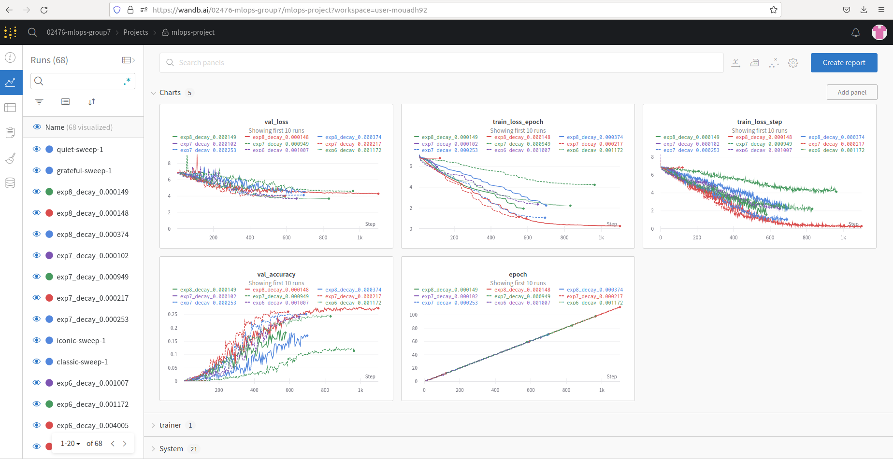
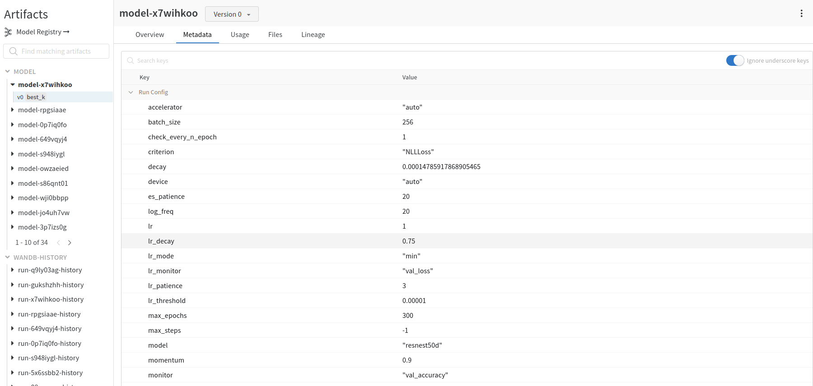
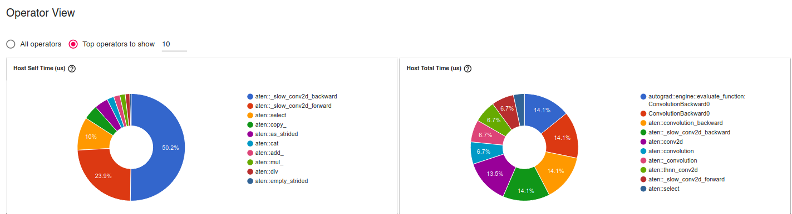

# Exam template for 02476 Machine Learning Operations

This is the report template for the exam. Please only remove the text formatted as with three dashes in front and behind
like:

```--- question 1 fill here ---```

where you instead should add your answers. Any other changes may have unwanted consequences when your report is auto
generated in the end of the course. For questions where you are asked to include images, start by adding the image to
the `figures` subfolder (please only use `.png`, `.jpg` or `.jpeg`) and then add the following code in your answer:

```markdown

```

In addition to this markdown file, we also provide the `report.py` script that provides two utility functions:

Running:

```bash
python report.py html
```

will generate an `.html` page of your report. After deadline for answering this template, we will autoscrape
everything in this `reports` folder and then use this utility to generate an `.html` page that will be your serve
as your final handin.

Running

```bash
python report.py check
```

will check your answers in this template against the constrains listed for each question e.g. is your answer too
short, too long, have you included an image when asked to.

For both functions to work it is important that you do not rename anything. The script have two dependencies that can
be installed with `pip install click markdown`.

## Group information

### Question 1
> **Enter the group number you signed up on <learn.inside.dtu.dk>**
>
> Answer:

--- question 1 fill here ---
> Group-7

### Question 2
> **Enter the study number for each member in the group**
>
> Example:
>
> *sXXXXXX, sXXXXXX, sXXXXXX*
>
> Answer:

--- question 2 fill here ---
> s212661, s225521, s212634, s220726
### Question 3
> **What framework did you choose to work with and did it help you complete the project?**
>
> Answer length: 100-200 words.
>
> Example:
> *We used the third-party framework ... in our project. We used functionality ... and functionality ... from the*
> *package to do ... and ... in our project*.
>
> Answer:

--- question 3 fill here ---

## Coding environment

> In the following section we are interested in learning more about you local development environment.

### Question 4

> **Explain how you managed dependencies in your project? Explain the process a new team member would have to go**
> **through to get an exact copy of your environment.**
>
> Answer length: 100-200 words
>
> Example:
> *We used ... for managing our dependencies. The list of dependencies was auto-generated using ... . To get a*
> *complete copy of our development enviroment, one would have to run the following commands*

--- question 4 fill here ---
> Answer:
> We used requirements.txt and requirement_test.txt for managing our dependencies. These two files include all the dependencies and their versions, this way the new team member would know what to install. Additionally, a README.md file with clear instructions on how to set up the development environment, including any setup commands, would be helpful for a new team member. 

### Question 5

> **We expect that you initialized your project using the cookiecutter template. Explain the overall structure of your**
> **code. Did you fill out every folder or only a subset?**
>
> Answer length: 100-200 words
>
> Example:
> *From the cookiecutter template we have filled out the ... , ... and ... folder. We have removed the ... folder*
> *because we did not use any ... in our project. We have added an ... folder that contains ... for running our*
> *experiments.*

--- question 5 fill here ---
> Answer: From the cookiecutter template we have filled out the src, reports folder and reformat conf.py in docs folder. We have removed the notebooks, references and models folder because we did not use any contents of them in our project. We have added an app, conf, model_store and tests folder that contains FastAPI, configurations, data drifting detector and units tets for data and model for running our experiments.


### Question 6

> **Did you implement any rules for code quality and format? Additionally, explain with your own words why these**
> **concepts matters in larger projects.**
>
> Answer length: 50-100 words.
>
> Answer:

--- question 6 fill here ---

## Version control

> In the following section we are interested in how version control was used in your project during development to
> corporate and increase the quality of your code.

### Question 7

> **How many tests did you implement?**
>
> Answer:
We have two kinds of unit tests. One is testing for data and the other is for model. 
For the data part, we want to make sure the shape of training set and validation set can be fitted into the regulated shape defined in the model, and the length of labeled class categories are the same as defined in the model; for the model part, we want to make sure that the shape of the output is the same as we wanted.

### Question 8

> **What is the total code coverage (in percentage) of your code? If you code had an code coverage of 100% (or close**
> **to), would you still trust it to be error free? Explain you reasoning.**
>
> Answer:
The total code coverage is about 40%, which includes all our source code and far from 100%. Even if our coverage can reach a higher level such as 100%, there's still possibilities that our codes aren't error free. Because we only implemented unit tests, where codes are separated into small units and checked if each small functions correctly, and we lack an integration test to evaluate if the model functions correctly so each separate units collaborate well, or an end-to-end test to check out if our codes could run on other terminals.
> *code and even if we were then...*

### Question 9

> **Did you workflow include using branches and pull requests? If yes, explain how. If not, explain how branches and**
> **pull request can help improve version control.**
>
> Answer:
No, we didn't use branches, since we split tasks to work parallelly. We have used pull requests to get everything up to date everytime before we picking up work on it.  
Braches can improve our team work in the way that if we want to experiment some new codes but also hope to prevent this from polluting and causing conflicts with our current codes, or if we want to create something independently and later decide if we want to have it included in the main project. By creating a "branch" from the "main", we could consistantly only dedicated to updating the branch without the risk of interrupting the major ongoing work. 

### Question 10

> **Did you use DVC for managing data in your project? If yes, then how did it improve your project to have version**
> **control of your data. If no, explain a case where it would be beneficial to have version control of your data.**
>
> Answer:
Yes, we have used DVC for original data, training data and trained best performed model storage. 
Since we have committed each update of our data and trained model, we could trace the performance of the best model based on each dataset. The original dataset has keeps updating and each process of training is based on different training set, DVC makes it accessible to compare and restore datasets.

### Question 11

> **Discuss you continues integration setup. What kind of CI are you running (unittesting, linting, etc.)? Do you test**
> **multiple operating systems, python version etc. Do you make use of caching? Feel free to insert a link to one of**
> **your github actions workflow.**
>
> Answer:
We have organized our CI into 5 separate files: Docker Image CI, Run black, Run flake8, Run isort, and Run tests. While black, flake8 and isort functions to check and format the codes and order files alphabetically, Docker Image CI builds a new docker image into the dockerhub everytime when there's an update, and the Run tests workflow functions to trigger unittesting from pytest and report a coverage rate.
Cache is applied to store the downloaded packages from the workflow, so that it wouldn't be downloaded everytime we make an update.
An example of a triggered workflow can be seen here: https://github.com/kristian-267/DTU-MLOps-Group7/blob/main/.github/workflows/docker.yml

## Running code and tracking experiments

> In the following section we are interested in learning more about the experimental setup for running your code and
> especially the reproducibility of your experiments.

### Question 12

> **How did you configure experiments? Did you make use of config files? Explain with coding examples of how you would**
> **run a experiment.**
>
> Answer length: 50-100 words.
>
> Example:
> *We used a simple argparser, that worked in the following way: python my_script.py --lr 1e-3 --batch_size 25*
>
> Answer:

> The hyperparameters are loaded from /conf/config.yaml . We can modify the hyperparameters in this file accordingly for the model training. We import this configuration into the train_model.py file in src/models/. The hyperparameters are passed through the function 
>```
>@hydra.main(config_path="../../conf", config_name="config.yaml")
>```
> Argparser was not needed since we used hydra.

### Question 13

> **Reproducibility of experiments are important. Related to the last question, how did you secure that no information**
> **is lost when running experiments and that your experiments are reproducible?**
>
> Answer length: 100-200 words.
>
> Example:
> *We made use of config files. Whenever an experiment is run the following happens: ... . To reproduce an experiment*
> *one would have to do ...*
>
> Answer:

> The hyperparameters are automatically saved based on the output of the model. For this, we used WandB, where the hyperparameters of the config file are stored, and thus the experiments are saved and any lost of information or overwritting is unlikely to happen. This can be seen in the function of the train_model.py file:
  
>   ```
>   wandb_logger = WandbLogger(
>        save_dir=paths.log_path + config.experiment.name,
>        log_model=config.wandb.log_model,
>   ```

### Question 14

> **Upload 1 to 3 screenshots that show the experiments that you have done in W&B (or another experiment tracking**
> **service of your choice). This may include loss graphs, logged images, hyperparameter sweeps etc. You can take**
> **inspiration from [this figure](figures/wandb.png). Explain what metrics you are tracking and why they are**
> **important.**
>
> Answer length: 200-300 words + 1 to 3 screenshots.
>
> Example:
> *As seen in the first image when have tracked ... and ... which both inform us about ... in our experiments.*
> *As seen in the second image we are also tracking ... and ...*
>
> Answer:
> The most interesting tracking info are the train/val loss and train/val accuracy graphs. These metrics show how performant is our model. The figure below shows a comparison between the different experiments performance. The loss function tells us if the learning of the model is well, it also gives us some parameters such as the number of epochs.
>

> As shown in the figure below, the training data and information are stored such as batch_size, model name, experiment name, max_epochs etc. These sets of data are logged for all runs.
>

### Question 15

> **Docker is an important tool for creating containerized applications. Explain how you used docker in your**
> **experiments? Include how you would run your docker images and include a link to one of your docker files.**
>
> Answer length: 100-200 words.
>
> Example:
> *For our project we developed several images: one for training, inference and deployment. For example to run the*
> *training docker image: `docker run trainer:latest lr=1e-3 batch_size=64`. Link to docker file: <weblink>*
>
> Answer:

> To ease reproducibility, we use Docker. Two docker images are built, one for [train](https://github.com/kristian-267/DTU-MLOps-Group7/blob/main/trainer.dockerfile) and the other for [predict](https://github.com/kristian-267/DTU-MLOps-Group7/blob/main/predict_image.dockerfile)
> We did not use local docker, instead, we used Gcloud container. We also used the predict_image.dockerfile for Cloud prediction/deployment using FastAPI image with Cloud run. The link can be found here []()
>  ```
>  docker build -f trainer.dockerfile . -t train:latest
>  ```

### Question 16

> **When running into bugs while trying to run your experiments, how did you perform debugging? Additionally, did you**
> **try to profile your code or do you think it is already perfect?**
>
> Answer length: 100-200 words.
>
> Example:
> *Debugging method was dependent on group member. Some just used ... and others used ... . We did a single profiling*
> *run of our main code at some point that showed ...*
>
> Answer:

> Most of the debugging was made through the Editor/IDE, in Visual Studio Code. In VSC, we go through the code line by line and fix any error that arises accordingly. We also used PyTorch profiling as it can be seen in the [train_model](https://github.com/kristian-267/DTU-MLOps-Group7/blob/main/src/models/train_model.py) file. The image below shows that the convulution functions are the ones that use most of the memory. It is difficult to profile the code, especially with such a large dataset, because the majority of computations is made elsewhere.
>  

## Working in the cloud

> In the following section we would like to know more about your experience when developing in the cloud.

### Question 17

> **List all the GCP services that you made use of in your project and shortly explain what each service does?**
>
> Answer length: 50-200 words.
>
> Example:
> *We used the following two services: Engine and Bucket. Engine is used for... and Bucket is used for...*
>
> Answer:

> *We used the following seven services: Engine, Container, Trigger, Buckets, Cloud Functions, Cloud Run and Monitoring. Engine is used for train model, Container is used for storage pushed *
> *dockers,Trigger is used for auto build and push docker, Buckets is used for cloud store of large data and trained models, Cloud Functions is used for serverless deployment of inference, *
> *Cloud Run is used for deployment of our inference application and Monitoring is used for setting alerts on big error number and latency.*

### Question 18

> **The backbone of GCP is the Compute engine. Explained how you made use of this service and what type of VMs**
> **you used?**
>
> Answer length: 50-100 words.
>
> Example:
> *We used the compute engine to run our ... . We used instances with the following hardware: ... and we started the*
> *using a custom container: ...*
>
> Answer:

> *We used the compute engine to run our ResNeSt model to classify images from ImageNet mini dataset. We used instances with the following hardware: CPU: n1-standard-1, GPU: 1 x NVIDIA V100, *
> *Disk size: 50 GB, and we started the training using a custom container: gcr.io/dtu-mlops-group7/gcp_vm_trainer, which stored in Container and includes nessarary files and dependencies.*

### Question 19

> **Insert 1-2 images of your GCP bucket, such that we can see what data you have stored in it.**
> **You can take inspiration from [this figure](figures/bucket.png).**
>
> Answer:

```markdown
[buckets](figures/bucket-group7.png)
```

### Question 20

> **Upload one image of your GCP container registry, such that we can see the different images that you have stored.**
> **You can take inspiration from [this figure](figures/registry.png).**
>
> Answer:

```markdown
[container registry](figures/registry-group7.png)
```

### Question 21

> **Upload one image of your GCP cloud build history, so we can see the history of the images that have been build in**
> **your project. You can take inspiration from [this figure](figures/build.png).**
>
> Answer:

```markdown
[cloud build](figures/build-group7.png)
```

### Question 22

> **Did you manage to deploy your model, either in locally or cloud? If not, describe why. If yes, describe how and**
> **preferably how you invoke your deployed service?**
>
> Answer length: 100-200 words.
>
> Example:
> *For deployment we wrapped our model into application using ... . We first tried locally serving the model, which*
> *worked. Afterwards we deployed it in the cloud, using ... . To invoke the service an user would call*
> *`curl -X POST -F "file=@file.json"<weburl>`*
>
> Answer:

> *For deployment we wrapped our model into application using local and cloud methods. We first tried locally serving the model, which began from building a prediction app using FastAPI. In this *
> *API, we send post request to upload an image file, then api returns the response, which including the label prediction result of this image. After that, we tried using Torchserve to deploy the *
> *model. To save space and running time, we scripted model using `torch.jit`, then call `torchserve` to transfer model to .mar format and locally deploy it. For cloud deployment, we used two gcp *
> *services: We deployed a serverless predictor in Cloud Function and a predictor app in Cloud Run built from docker stored in Container. To use serverless predictor, To invoke the Cloud Run *
> *service, one can open this url to upload image file and execute inference: *
> *`https://gcp-vm-predictor-56ipobkfaa-ew.a.run.app`*
> *To use serverless predictor, an user would call: *
> *`curl -m 70 -X POST https://europe-west1-dtu-mlops-group7.cloudfunctions.net/predictor -H "Authorization: bearer $(gcloud auth print-identity-token)" -H "Content-Type: application/json" -d '{"prediction": "True"}'`*

### Question 23

> **Did you manage to implement monitoring of your deployed model? If yes, explain how it works. If not, explain how**
> **monitoring would help the longevity of your application.**
>
> Answer length: 100-200 words.
>
> Example:
> *We did not manage to implement monitoring. We would like to have monitoring implemented such that over time we could*
> *measure ... and ... that would inform us about this ... behaviour of our application.*
>
> Answer:

> *We did manage to implement monitoring. For local deployment, we integrated opentelemetry into FastAPI-based prediction app we deployed before and used Signoz to monitor its varies metrics. *
> *To let it work, first open docker desktop and run container named clickhouse-setup, then navigate to `http://localhost:3301` and run command `OTEL_EXPORTER_OTLP_ENDPOINT="http://localhost:4318/" OTEL_SERVICE_NAME="dtu-mlops-group7" python -m uvicorn app.predict_image:app --reload`, afterwards you can see dtu-mlops-group7 application pop out from Signoz page and click it to see monitor *
> *results. For cloud deployment, we set Alerting in GCP Monitor service to monitor error number for predictor function and latency metrics for gcp-vm-predictor service, those metrics are useful for *
> *us knowing the running conditions of our application.*

### Question 24

> **How many credits did you end up using during the project and what service was most expensive?**
>
> Answer length: 25-100 words.
>
> Example:
> *Group member 1 used ..., Group member 2 used ..., in total ... credits was spend during development. The service*
> *costing the most was ... due to ...*
>
> Answer:

> *Group member Chuansheng Liu used $49.37, Group member Chongchong Li used $12.07, Group member Xindi Wu used $16.29, Group member Mouadh Sadani used $21.51, in total $99.24 credits was spend during development. The service Compute Engine costing the most was $41.29 due to train model on a GPU instance.*

## Overall discussion of project

> In the following section we would like you to think about the general structure of your project.

### Question 25

> **Include a figure that describes the overall architecture of your system and what services that you make use of.**
> **You can take inspiration from [this figure](figures/overview.png). Additionally in your own words, explain the**
> **overall steps in figure.**
>
> Answer length: 200-400 words
>
> Example:
>
> *The starting point of the diagram is our local setup, where we integrated ... and ... and ... into our code.*
> *Whenever we commit code and puch to github, it auto triggers ... and ... . From there the diagram shows ...*
>
> Answer:

--- question 25 fill here ---

### Question 26

> **Discuss the overall struggles of the project. Where did you spend most time and what did you do to overcome these**
> **challenges?**
>
> Answer length: 200-400 words.
>
> Example:
> *The biggest challenges in the project was using ... tool to do ... . The reason for this was ...*
>
> Answer:

--- question 26 fill here ---

### Question 27

> **State the individual contributions of each team member. This is required information from DTU, because we need to**
> **make sure all members contributed actively to the project**
>
> Answer length: 50-200 words.
>
> Example:
> *Student sXXXXXX was in charge of developing of setting up the initial cookie cutter project and developing of the*
> *docker containers for training our applications.*
> *Student sXXXXXX was in charge of training our models in the cloud and deploying them afterwards.*
> *All members contributed to code by...*
>
> Answer:

--- question 27 fill here ---
